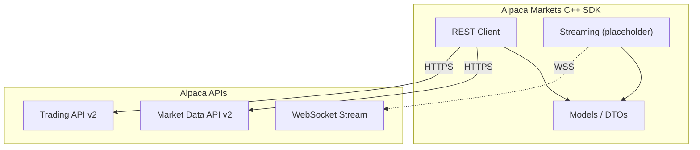
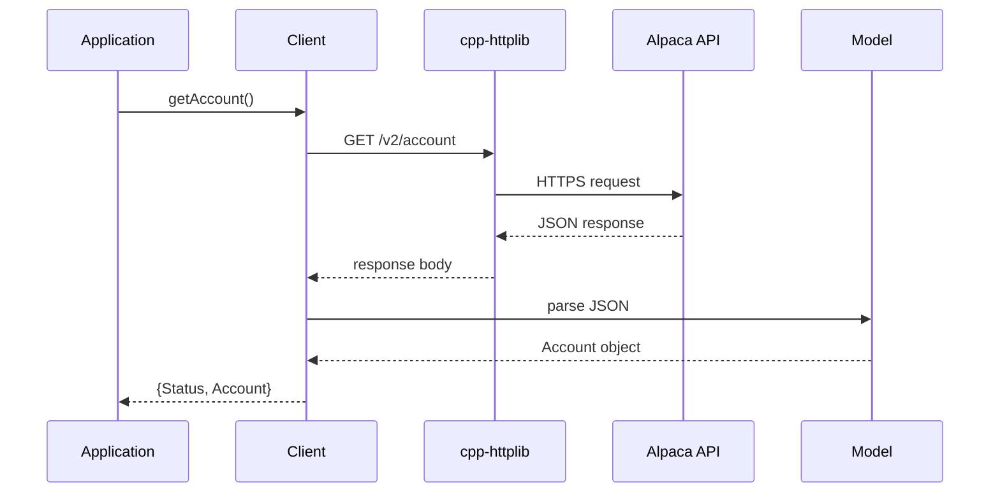

# Alpaca Markets C++ SDK

A modern C++ SDK for the [Alpaca](https://alpaca.markets/) Trading and Market Data APIs.

## Features

- **Trading API v2**: Full support for account, orders, positions, assets, watchlists, and portfolio history
- **Market Data API v2**: Historical bars, latest trades, and latest quotes for stocks
- **Modern C++20**: Clean API with proper namespacing and modern idioms
- **CMake-based**: Easy integration with CMake-based projects
- **Header-only friendly**: Include only what you need
- **Warning-free builds**: Third-party library warnings silenced; our code compiles with strict warnings (`-Wall -Wextra -Wpedantic`)

## Quick Start

### Prerequisites

- C++20 compatible compiler (GCC 11+, Clang 14+, MSVC 2022+)
- CMake 3.25+
- OpenSSL development libraries

### Building

```bash
# Clone the repository
git clone https://github.com/your-org/alpaca-markets-cpp.git
cd alpaca-markets-cpp

# Build
make build

# Run tests
make test
```

### Installing & Using in Another CMake Project

There are **three main ways** to use this library in your project:

#### Option 1: FetchContent (Recommended for most projects)

The easiest way to use `alpaca-markets-cpp` is with CMake's `FetchContent` module:

```cmake
cmake_minimum_required(VERSION 3.25)
project(my_trading_app)

set(CMAKE_CXX_STANDARD 20)

include(FetchContent)
FetchContent_Declare(
    alpaca_markets
    GIT_REPOSITORY https://github.com/your-org/alpaca-markets-cpp.git
    GIT_TAG        main  # or a specific tag like v1.0.0
)
FetchContent_MakeAvailable(alpaca_markets)

add_executable(my_app main.cpp)
target_link_libraries(my_app PRIVATE alpaca::markets)
```

When used via FetchContent:

- Tests and examples are automatically disabled for the dependency
- Dependencies (RapidJSON, cpp-httplib) are fetched automatically
- No system installation required

#### Option 2: System Installation with find_package()

Install the library to your system or a custom prefix:

```bash
# Configure and build
cmake -S . -B build -DCMAKE_BUILD_TYPE=Release

# Build
cmake --build build --config Release

# Install (to system or custom prefix)
cmake --install build --prefix /usr/local  # or ~/.local, /opt/alpaca, etc.
```

Then use in your project:

```cmake
cmake_minimum_required(VERSION 3.20)
project(my_trading_app)

set(CMAKE_CXX_STANDARD 20)

# Find the installed package
find_package(alpaca_markets REQUIRED)

add_executable(my_app main.cpp)
target_link_libraries(my_app PRIVATE alpaca::markets)
```

If installed to a non-standard prefix, add it to `CMAKE_PREFIX_PATH`:

```bash
cmake -B build -DCMAKE_PREFIX_PATH=/opt/alpaca
```

#### Option 3: Add as Git Submodule

```bash
git submodule add https://github.com/your-org/alpaca-markets-cpp.git external/alpaca-markets-cpp
```

```cmake
add_subdirectory(external/alpaca-markets-cpp)

add_executable(my_app main.cpp)
target_link_libraries(my_app PRIVATE alpaca::markets)
```

### System Dependencies

The library requires these system dependencies:

| Dependency        | Purpose            | Install (Ubuntu/Debian)         |
|-------------------|--------------------|---------------------------------|
| OpenSSL           | HTTPS support      | `apt install libssl-dev`        |
| ZLIB              | Compression        | `apt install zlib1g-dev`        |
| Brotli (optional) | Brotli compression | `apt install libbrotli-dev`     |

#### Dependency Options

- `ALPACA_MARKETS_USE_SYSTEM_RAPIDJSON=ON` to use a system RapidJSON package.
- `ALPACA_MARKETS_USE_SYSTEM_HTTPLIB=ON` to use a system cpp-httplib package.

### Environment Variables

Set the following environment variables before running:

```bash
# Required
export APCA_API_KEY_ID="your-api-key"
export APCA_API_SECRET_KEY="your-secret-key"

# Optional (defaults to paper trading)
export APCA_API_BASE_URL="https://paper-api.alpaca.markets"  # or https://api.alpaca.markets for live
export APCA_API_DATA_URL="https://data.alpaca.markets"
```

Or use the new naming convention:

```bash
export ALPACA_MARKETS_KEY_ID="your-api-key"
export ALPACA_MARKETS_SECRET_KEY="your-secret-key"
export ALPACA_MARKETS_TRADING_URL="https://paper-api.alpaca.markets"  # base host (no /v2)
export ALPACA_MARKETS_DATA_URL="https://data.alpaca.markets"
```

If you prefer a `.env` file, this repo also supports a more explicit naming scheme (and maps it to the variables above):

```bash
# Paper trading (endpoint + key id)
ALPACA_MARKETS_PAPER_TRADING_API_ENDPOINT="https://paper-api.alpaca.markets"
ALPACA_MARKETS_PAPER_TRADING_API_KEY_ID="your-paper-key-id"

# Live/individual (endpoint + key id + secret)
ALPACA_MARKETS_INDIVIDUAL_API_ENDPOINT="https://api.alpaca.markets"
ALPACA_MARKETS_INDIVIDUAL_API_KEY_ID="your-live-key-id"
ALPACA_MARKETS_INDIVIDUAL_API_SECRET_KEY="your-live-secret"
```

### Example Usage

```cpp
#include <alpaca/markets/markets.hpp>
#include <iostream>

int main() {
    // Parse environment configuration
    alpaca::markets::Environment env;
    if (alpaca::markets::Status status = env.parse(); !status.ok()) {
        std::cerr << "Error: " << status.getMessage() << std::endl;
        return 1;
    }

    // Create client
    alpaca::markets::Client client(env);

    // Get account information
    auto [status, account] = client.getAccount();
    if (!status.ok()) {
        std::cerr << "Error: " << status.getMessage() << std::endl;
        return 1;
    }

    std::cout << "Account ID: " << account.id << std::endl;
    std::cout << "Buying Power: $" << account.buying_power << std::endl;

    // Get latest quote for a stock
    auto [quote_status, quote] = client.getLatestQuote("AAPL");
    if (quote_status.ok()) {
        std::cout << "AAPL Bid: $" << quote.quote.bid_price << std::endl;
        std::cout << "AAPL Ask: $" << quote.quote.ask_price << std::endl;
    }

    return 0;
}
```

## Architecture



### REST Request Flow



## Project Structure

```text
alpaca-markets-cpp/
├── CMakeLists.txt          # Main CMake configuration
├── Makefile                # Developer workflow targets
├── include/
│   └── alpaca/
│       └── markets/        # Public headers
│           ├── markets.hpp # Umbrella header
│           ├── client.hpp  # REST API client
│           ├── config.hpp  # Environment configuration
│           └── ...         # Model headers
├── src/                    # Implementation files
├── tests/                  # Unit tests
├── examples/               # Example applications
└── cmake/                  # CMake modules (for future use)
```

## API Reference

### Client Methods

#### Account

- `getAccount()` - Get account information
- `getAccountConfigurations()` - Get account settings
- `updateAccountConfigurations()` - Update account settings
- `getAccountActivity()` - Get account activity history

#### Orders

- `getOrders()` - List orders
- `getOrder()` - Get specific order
- `submitOrder()` - Submit new order (supports trailing stop with `trail_price`/`trail_percent`)
- `submitNotionalOrder()` - Submit order by dollar amount (fractional shares)
- `replaceOrder()` - Replace existing order
- `cancelOrder()` - Cancel order
- `cancelOrders()` - Cancel all orders

**Order Types:** Market, Limit, Stop, StopLimit, TrailingStop

**Order Classes:** Simple, Bracket, OneCancelsOther, OneTriggersOther, MultiLeg

#### Positions

- `getPositions()` - List all positions
- `getPosition()` - Get position for symbol
- `closePosition()` - Close position
- `closePositions()` - Close all positions

#### Assets

- `getAssets()` - List assets (supports `USEquity` and `Crypto` asset classes)
- `getAsset()` - Get asset details

#### Market Data (v2)

- `getBars()` - Get historical bar data
- `getLatestTrade()` - Get latest trade for symbol
- `getLatestQuote()` - Get latest quote for symbol
- `getLatestTrades()` - Get latest trades for multiple symbols
- `getLatestQuotes()` - Get latest quotes for multiple symbols
- `getLatestBar()` - Get latest bar for symbol
- `getLatestBars()` - Get latest bars for multiple symbols
- `getSnapshot()` - Get market snapshot (trade, quote, bars) for symbol
- `getSnapshots()` - Get market snapshots for multiple symbols
- `getTrades()` - Get historical trades with pagination
- `getQuotes()` - Get historical quotes with pagination
- `getMultiTrades()` - Get historical trades for multiple symbols with pagination
- `getMultiQuotes()` - Get historical quotes for multiple symbols with pagination
- `getAuctions()` - Get auction data (opening/closing) for a symbol
- `getMultiAuctions()` - Get auction data for multiple symbols

#### Market Data Corporate Actions

- `getCorporateActions()` - Get corporate actions (splits, dividends, mergers, name changes, etc.)

#### News

- `getNews()` - Get news articles with symbol filtering and pagination

#### Crypto Market Data

- `getLatestCryptoTrade()` / `getLatestCryptoTrades()` - Latest crypto trades
- `getLatestCryptoQuote()` / `getLatestCryptoQuotes()` - Latest crypto quotes
- `getLatestCryptoBar()` / `getLatestCryptoBars()` - Latest crypto bars
- `getCryptoSnapshot()` / `getCryptoSnapshots()` - Crypto market snapshots
- `getCryptoBars()` - Historical crypto bars
- `getCryptoTrades()` - Historical crypto trades
- `getCryptoQuotes()` - Historical crypto quotes

#### Options

- `getOptionContracts()` - List option contracts with filters
- `getOptionContract()` - Get specific option contract by symbol or ID

#### Watchlists

- `getWatchlists()` - List watchlists
- `getWatchlist()` - Get watchlist by ID
- `createWatchlist()` - Create new watchlist
- `updateWatchlist()` - Update watchlist
- `deleteWatchlist()` - Delete watchlist

#### Corporate Actions (Trading API)

- `getAnnouncements()` - Get corporate action announcements (dividends, splits, mergers, spinoffs)
- `getAnnouncement()` - Get specific announcement by ID

#### Clock & Calendar

- `getClock()` - Get market clock
- `getCalendar()` - Get market calendar

### Error Handling

The SDK provides typed API errors similar to official SDKs:

```cpp
// APIError provides detailed error information from the Alpaca API
alpaca::markets::APIError err(422, 40010000, "insufficient qty available for order");
std::cerr << err.what() << std::endl;
// Output: insufficient qty available for order (HTTP 422, Code 40010000)

// Convert to Status for uniform error handling
alpaca::markets::Status status = err.toStatus();
```

### Retry & Timeout Configuration

Configure request resiliency with retry and timeout settings:

```cpp
alpaca::markets::Environment env;
env.parse();

// Configure retries with exponential backoff
alpaca::markets::RetryConfig retry;
retry.max_retries = 5;
retry.initial_delay = std::chrono::milliseconds{100};
retry.max_delay = std::chrono::milliseconds{5000};
retry.backoff_multiplier = 2.0;
env.setRetryConfig(retry);

// Configure timeouts
alpaca::markets::TimeoutConfig timeout;
timeout.connection_timeout = std::chrono::seconds{30};
timeout.read_timeout = std::chrono::seconds{60};
env.setTimeoutConfig(timeout);
```

### Pagination Helpers

Use `PageIterator` for convenient iteration over paginated results:

```cpp
#include <alpaca/markets/pagination.hpp>

// Manually iterate through pages
auto [status, result] = client.getTrades("AAPL", start, end, 100);
while (status.ok() && !result.second.empty()) {
    for (const auto& trade : result.first) {
        process(trade);
    }
    auto [s, r] = client.getTrades("AAPL", start, end, 100, result.second);
    status = s;
    result = r;
}
```

## Make Targets

| Target       | Description                                      |
|--------------|--------------------------------------------------|
| `make build` | Build the project                                |
| `make test`  | Run unit tests                                   |
| `make lint`  | Run linting (requires clang-format, clang-tidy)  |
| `make clean` | Remove build directory                           |
| `make help`  | Show available targets                           |

## Feature Parity with Official SDKs

This C++ SDK aims to provide feature parity with Alpaca's official SDKs:

| Feature                       | Status         |
|-------------------------------|----------------|
| Trading API v2                | ✅             |
| Market Data API v2            | ✅             |
| Options Contracts API         | ✅             |
| Market Snapshots              | ✅             |
| Historical Trades/Quotes      | ✅             |
| Multi-Symbol Historical Data  | ✅             |
| Auctions Data                 | ✅             |
| Market Data Corporate Actions | ✅             |
| Trailing Stop Orders          | ✅             |
| Notional (Dollar) Orders      | ✅             |
| Multi-Symbol Quotes/Trades    | ✅             |
| Corporate Actions (Trading)   | ✅             |
| Crypto Asset Class            | ✅             |
| Typed API Errors              | ✅             |
| Crypto Market Data            | ✅             |
| News API                      | ✅             |
| Retry/Backoff Configuration   | ✅             |
| Timeout Configuration         | ✅             |
| Pagination Helpers            | ✅             |
| WebSocket Streaming           | 🔄 Placeholder |

## License

See [LICENSE](LICENSE) file.
