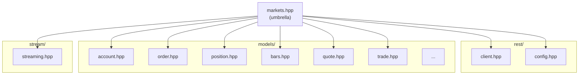

# Include Directory

This directory contains the public headers for the Alpaca Markets C++ SDK.

## Header Structure



## Directory Structure

```txt
include/
└── alpaca/
    └── markets/
        ├── *.hpp               # Forwarding headers for backward compatibility
        ├── models/             # Data transfer objects (DTOs)
        ├── rest/               # REST API components
        └── stream/             # Streaming components
```

## Usage

Include the umbrella header to get everything:

```cpp
#include <alpaca/markets/markets.hpp>
```

Or include only what you need:

```cpp
#include <alpaca/markets/client.hpp>
#include <alpaca/markets/config.hpp>
```

## Namespace

All types are in the `alpaca::markets` namespace:

```cpp
alpaca::markets::Client
alpaca::markets::Environment
alpaca::markets::Account
alpaca::markets::Order
// etc.
```

Streaming types are in `alpaca::markets::stream`:

```cpp
alpaca::markets::stream::Handler
alpaca::markets::stream::MessageGenerator
```

## Selective Builds

Each subdirectory under `markets/` has its own `Makefile` for building only that module:

```bash
# Build only models
cd include/alpaca/markets/models && make build

# Build only REST client
cd include/alpaca/markets/rest && make build

# Build only streaming
cd include/alpaca/markets/stream && make build
```

## Make Targets

From this directory or the project root:

- `make build` - Build the library
- `make models` - Build only the models module (from repo root)
- `make rest` - Build only the REST module (from repo root)
- `make stream` - Build only the streaming module (from repo root)
- `make lint` - Check header formatting
