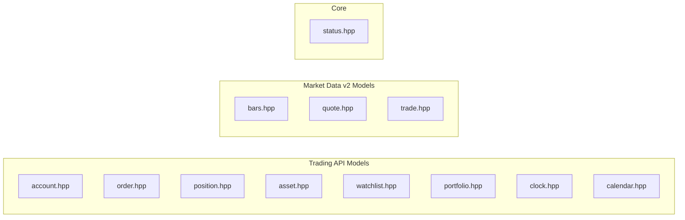

# Model Headers

This directory contains the public headers for model DTOs (Data Transfer Objects) used by the Alpaca Markets C++ SDK.

## Model Categories



## Headers

| File            | Description                                                    |
| --------------- | -------------------------------------------------------------- |
| status.hpp      | Status/error handling class                                    |
| account.hpp     | Account, AccountConfigurations, activity models                |
| asset.hpp       | Asset model                                                    |
| bars.hpp        | Bar/OHLCV data (Market Data v2)                                |
| calendar.hpp    | Calendar date model                                            |
| clock.hpp       | Market clock model                                             |
| order.hpp       | Order model and enums (side, type, time-in-force, class)       |
| portfolio.hpp   | Portfolio history model                                        |
| position.hpp    | Position model                                                 |
| quote.hpp       | Quote data (Market Data v2)                                    |
| trade.hpp       | Trade data (Market Data v2)                                    |
| watchlist.hpp   | Watchlist model                                                |

## Usage

Include individual model headers:

```cpp
#include <alpaca/markets/models/account.hpp>
#include <alpaca/markets/models/order.hpp>
```

Or use the forwarding headers from the parent directory:

```cpp
#include <alpaca/markets/account.hpp>
#include <alpaca/markets/order.hpp>
```

Or include everything via the umbrella header:

```cpp
#include <alpaca/markets/markets.hpp>
```

## Building

Build the models module:

```bash
make build
# or from the repo root:
make models
```

## Make Targets

| Target | Description               |
| ------ | ------------------------- |
| build  | Build the models module   |
| clean  | Clean the build directory |
| lint   | Lint model header files   |
| help   | Show available targets    |
