# REST Client Headers

This directory contains the public headers for the REST API client of the Alpaca Markets C++ SDK.

## Request Flow

```mermaid
sequenceDiagram
    participant App as Application
    participant Client as Client
    participant HTTP as cpp-httplib
    participant API as Alpaca API

    App->>Client: client.getAccount()
    Client->>Client: Build headers (auth)
    Client->>HTTP: GET /v2/account
    HTTP->>API: HTTPS request
    API-->>HTTP: JSON response
    HTTP-->>Client: Response body
    Client->>Client: Parse JSON → Model
    Client-->>App: {Status, Account}
```



## Headers

| File       | Description                                                         |
| ---------- | ------------------------------------------------------------------- |
| client.hpp | REST API client class declaration                                   |
| config.hpp | Environment configuration (API keys, URLs, env var parsing)         |

## Usage

Include the REST headers:

```cpp
#include <alpaca/markets/rest/client.hpp>
#include <alpaca/markets/rest/config.hpp>
```

Or use the forwarding headers from the parent directory:

```cpp
#include <alpaca/markets/client.hpp>
#include <alpaca/markets/config.hpp>
```

Or include everything via the umbrella header:

```cpp
#include <alpaca/markets/markets.hpp>
```

## Example

```cpp
#include <alpaca/markets/rest/config.hpp>
#include <alpaca/markets/rest/client.hpp>

int main() {
    alpaca::markets::Environment env;
    if (alpaca::markets::Status status = env.parse(); !status.ok()) {
        return 1;
    }

    alpaca::markets::Client client(env);
    auto [status, account] = client.getAccount();
    // ...
}
```

## Building

Build the REST module:

```bash
make build
# or from the repo root:
make rest
```

## Make Targets

| Target | Description               |
| ------ | ------------------------- |
| build  | Build the REST module     |
| clean  | Clean the build directory |
| lint   | Lint REST header files    |
| help   | Show available targets    |
