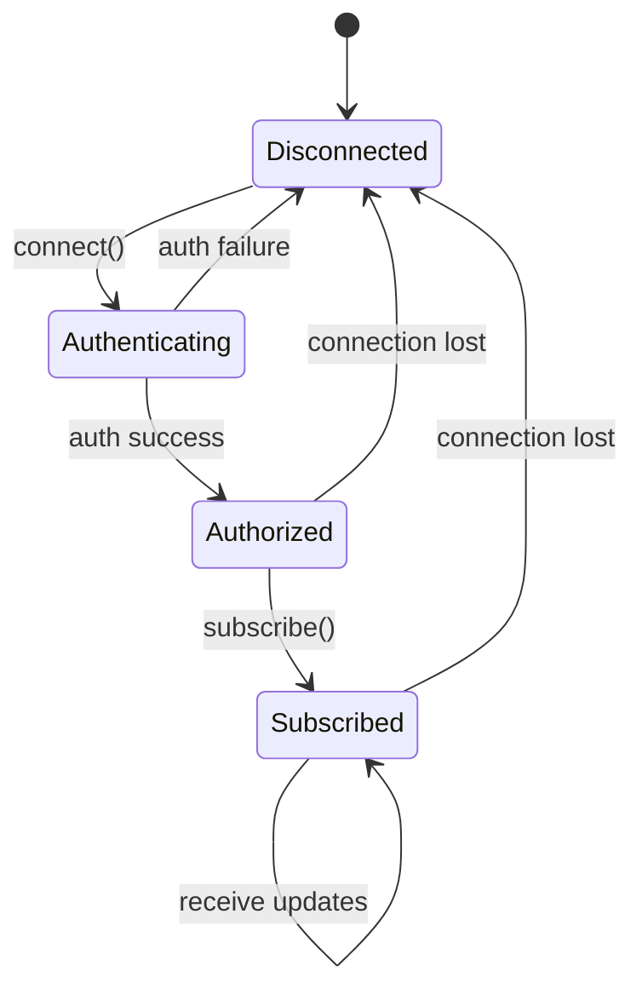

# Streaming Headers

This directory contains the public headers for WebSocket streaming in the Alpaca Markets C++ SDK.

## Message Flow



> ⚠️ **Note**: This module provides message generation and parsing only. A WebSocket client library (e.g., Boost.Beast) is required for actual connections.

## Headers

| File             | Description                                              |
| ---------------- | -------------------------------------------------------- |
| streaming.hpp    | Streaming handler, message generator, and reply parser   |

## Usage

Include the streaming headers:

```cpp
#include <alpaca/markets/stream/streaming.hpp>
```

Or use the forwarding header from the parent directory:

```cpp
#include <alpaca/markets/streaming.hpp>
```

Or include everything via the umbrella header:

```cpp
#include <alpaca/markets/markets.hpp>
```

## Current Status

⚠️ **Placeholder**: The streaming module provides message generation and parsing utilities for the trading stream protocol, but does not include a full WebSocket client implementation.

## Supported Message Types

- Authentication messages
- Stream subscription (`trade_updates`, `account_updates`)
- Trade update parsing
- Account update parsing

## Building

Build the streaming module:

```bash
make build
# or from the repo root:
make stream
```

## Make Targets

| Target | Description                  |
| ------ | ---------------------------- |
| build  | Build the streaming module   |
| clean  | Clean the build directory    |
| lint   | Lint streaming header files  |
| help   | Show available targets       |
