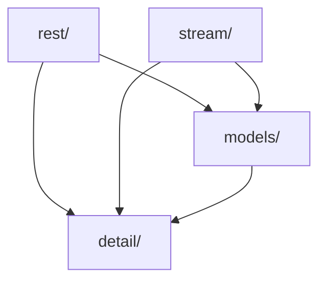

# Source Directory

This directory contains the implementation files for the Alpaca Markets C++ SDK.

## Module Dependencies



## Directory Structure

```txt
src/
├── detail/              # Internal implementation details
├── models/              # Model implementations
├── rest/                # REST API implementations
└── stream/              # Streaming implementations
```

## Selective Builds

Each subdirectory has its own `Makefile` for building only that module:

```bash
# Build only models
cd src/models && make build
# or from repo root:
make models

# Build only REST client
cd src/rest && make build
# or from repo root:
make rest

# Build only streaming
cd src/stream && make build
# or from repo root:
make stream
```

## Dependencies

- **RapidJSON**: JSON parsing (fetched via CMake FetchContent)
- **cpp-httplib**: HTTP/HTTPS client (fetched via CMake FetchContent)
- **OpenSSL**: TLS support for HTTPS

## Make Targets

From this directory or the project root:

- `make build` - Build the library
- `make models` - Build only the models module
- `make rest` - Build only the REST module
- `make stream` - Build only the streaming module
- `make lint` - Run clang-tidy on source files (if available)
