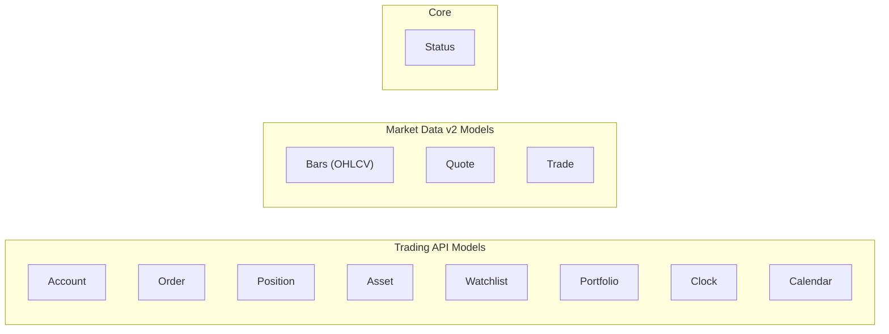

# Models Implementation

This directory contains the implementation files for model DTOs (Data Transfer Objects) used by the Alpaca Markets C++ SDK.

## Model Categories



## Files

| File          | Description                                            |
| ------------- | ------------------------------------------------------ |
| account.cpp   | Account and AccountConfigurations JSON parsing         |
| asset.cpp     | Asset model JSON parsing                               |
| bars.cpp      | Bar/OHLCV data JSON parsing (Market Data v2)           |
| calendar.cpp  | Calendar date model JSON parsing                       |
| clock.cpp     | Market clock model JSON parsing                        |
| order.cpp     | Order model and enum string conversions                |
| portfolio.cpp | Portfolio history JSON parsing                         |
| position.cpp  | Position model JSON parsing                            |
| quote.cpp     | Quote data JSON parsing (Market Data v2)               |
| status.cpp    | Status class and action status conversions             |
| trade.cpp     | Trade data JSON parsing (Market Data v2)               |
| watchlist.cpp | Watchlist model JSON parsing                           |

## Building

Build only the models module:

```bash
make build
# or from the repo root:
make models
```

## Make Targets

| Target | Description                  |
| ------ | ---------------------------- |
| build  | Build only the models module |
| clean  | Clean the build directory    |
| lint   | Lint model source files      |
| help   | Show available targets       |

## Dependencies

- RapidJSON (for JSON parsing)
- Headers from `include/alpaca/markets/models/`
