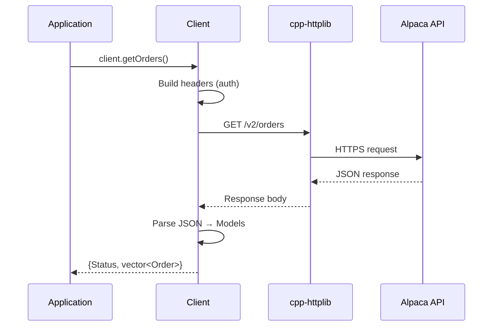

# REST Client Implementation

This directory contains the implementation of the REST API client for the Alpaca Markets C++ SDK.

## Request Flow



## Files

| File       | Description                                                                       |
| ---------- | --------------------------------------------------------------------------------- |
| client.cpp | REST API client implementation (account, orders, positions, assets, market data)  |
| config.cpp | Environment configuration parsing (env vars, URL validation)                      |

## Building

Build only the REST module:

```bash
make build
# or from the repo root:
make rest
```

## Make Targets

| Target | Description                  |
| ------ | ---------------------------- |
| build  | Build only the REST module   |
| clean  | Clean the build directory    |
| lint   | Lint REST source files       |
| help   | Show available targets       |

## API Endpoints

The client implements the following Alpaca API endpoints:

### Trading API v2

- `/v2/account` - Account information
- `/v2/account/configurations` - Account settings
- `/v2/account/activities` - Account activity history
- `/v2/orders` - Order management
- `/v2/positions` - Position management
- `/v2/assets` - Asset lookup
- `/v2/clock` - Market clock
- `/v2/calendar` - Market calendar
- `/v2/watchlists` - Watchlist management
- `/v2/account/portfolio/history` - Portfolio history

### Market Data API v2

- `/v2/stocks/bars` - Historical bar data
- `/v2/stocks/{symbol}/trades/latest` - Latest trade
- `/v2/stocks/{symbol}/quotes/latest` - Latest quote

## Dependencies

- cpp-httplib (HTTP client)
- OpenSSL (TLS support)
- RapidJSON (JSON parsing)
