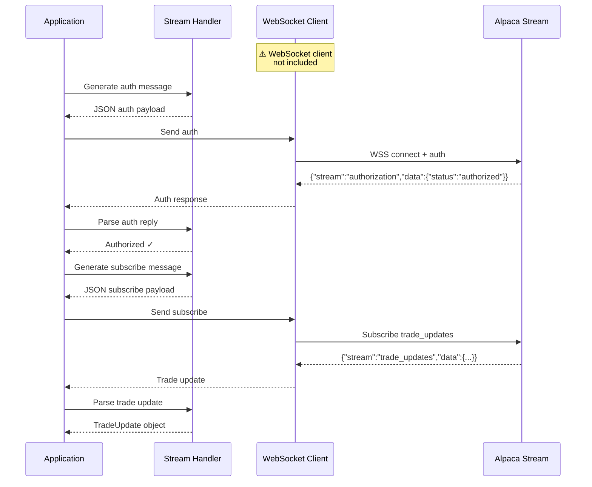

# Streaming Implementation

This directory contains the streaming/WebSocket implementation for the Alpaca Markets C++ SDK.

## Message Flow



## Files

| File            | Description                                                       |
| --------------- | ----------------------------------------------------------------- |
| streaming.cpp   | WebSocket message generation and reply parsing for trading stream |

## Building

Build only the streaming module:

```bash
make build
# or from the repo root:
make stream
```

## Make Targets

| Target | Description                      |
| ------ | -------------------------------- |
| build  | Build only the streaming module  |
| clean  | Clean the build directory        |
| lint   | Lint streaming source files      |
| help   | Show available targets           |

## Current Status

⚠️ **Placeholder Implementation**: The streaming module currently provides message generation and parsing utilities, but does not include a full WebSocket client. A WebSocket library (e.g., Boost.Beast, libwebsockets) would be needed for actual streaming connections.

## Supported Streams

The message generator and parser support:

- `trade_updates` - Order fill/cancel/reject notifications
- `account_updates` - Account balance changes

## Stream Endpoint

Trading stream connects to: `wss://{trading-host}/stream`

- Paper: `wss://paper-api.alpaca.markets/stream`
- Live: `wss://api.alpaca.markets/stream`

## Dependencies

- RapidJSON (JSON parsing/generation)
